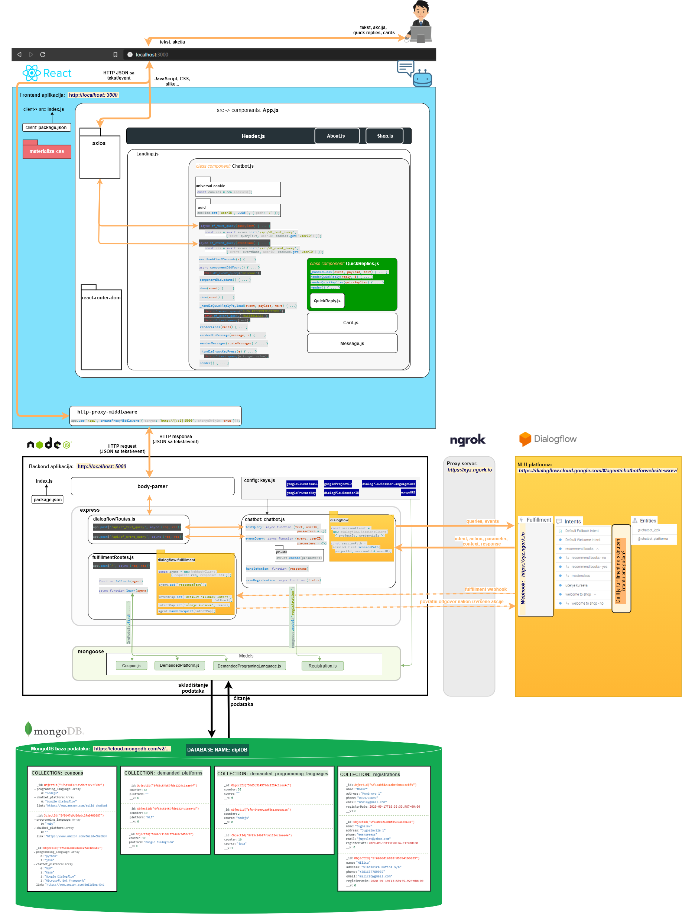
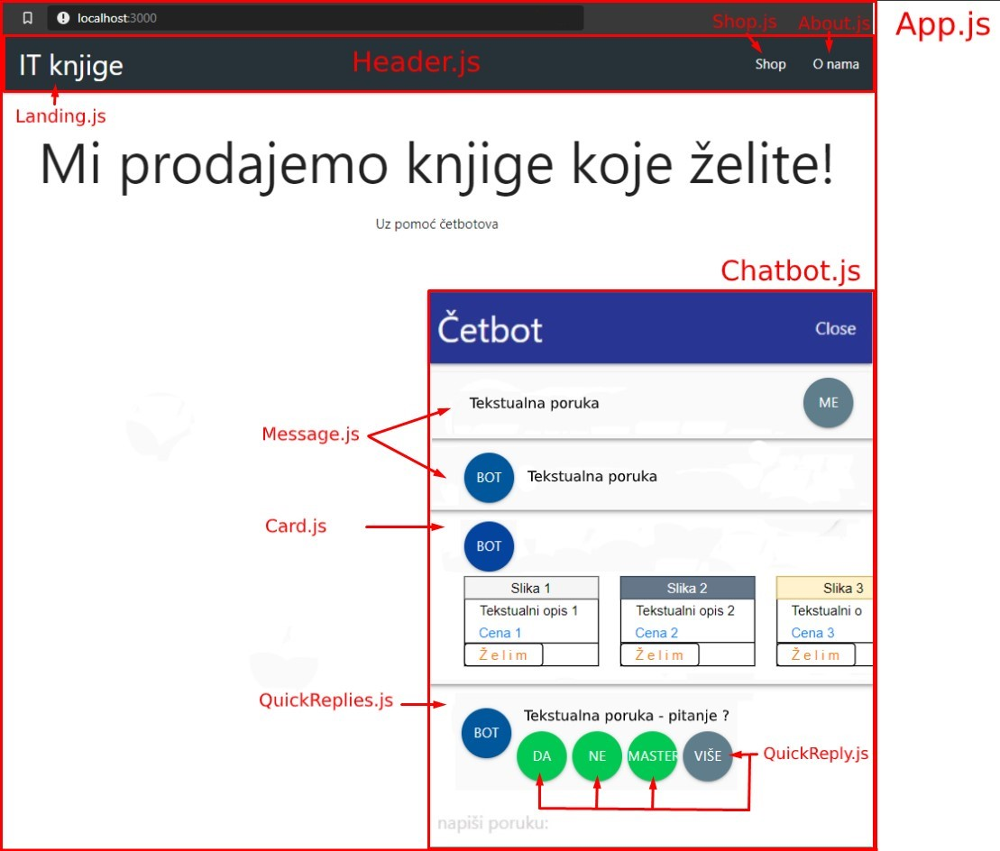

# Chatbot for e-commerce - NLP web based chatbot for recommending books about chatbots

 ## Descirption:
 Web-based chatbot for e-commerce implemented using NLU of DialogFlow, React, NodeJs & MongoDB.

 ## Architecture: Chatbot components and interaction
 
 

 ## Featured technologies, 3rd party solutions & used platforms
   ## Backend app: [Node.js](https://nodejs.org/)  
*An asynchronous event driven, open source, free environment for JavaScript applications built on Chrome’s v8 engine. The reason for this choice is its popularity - it's puting it in the first place of the most used programming languages, which means the availability of documentation and solutions to potential problems, which facilitates and speed up development.* 
  
        **Used libraries:**  
            &emsp;- [express](https://expressjs.com/) - the most popular web framework for Node.js and the basic library for many other web frameworks used with Node.js  
            &emsp;- [nodemon](https://www.npmjs.com/package/nodemon) - helps develop Node.js applications by automatically restarting the Node.js application when changes occur in the code file  
            &emsp;- [body-parser](https://www.npmjs.com/package/body-parser) - once an integral part of the express, and from Express.js version 4 the module functions as a separate unit. It is used to manage an incoming HTTP POST request, from where the contents of its body are extracted and displayed in req.body. Parses: JSON, buffer, string, URL encoded data sent via HTTP POST request  
            &emsp;- [dialogflowAPI:Node.jsClient](https://googleapis.dev/nodejs/dialogflow/latest/index.html) - allows sending text query and event query to Dialogflow; queries: detects, creates, updates, deletes intents, entities, context, sessions, etc.  
            &emsp;- [pb-util](https://www.npmjs.com/package/pb-util) - used to encode JSON values ​​in google.protobuf.Value. Google uses gRPC, and React REST HTTP API calls  
            &emsp;- [mongoose](https://www.npmjs.com/package/mongoose) - the tool was used to model the object for the MongoDB database. It is designed for an asynchronous environment. Supports both promise and callbacks  
            &emsp;- [dialogflow-fulfillment](https://www.npmjs.com/package/dialogflow-fulfillment) - the library enables the connection of systems, databases and APIs with Dialogflow (a system for understanding and processing natural language) with intents on Dialogflow on which the webhook call for fulfillment is enabled  
            &emsp;- [actions-on-google](https://www.npmjs.com/package/actions-on-google) - this client library is commonly used to create actions for Google Assistant and supports Actions SDK, Smart Home and Dialogflow fulfillment, for which is required to properly work  
 
   ## Frontend app: [React](https://reactjs.org/)
   *JavaScript library for building user interface. Used in project because it is the most popular choice among developers.*  
    
        **Used libraries:**  
            &emsp;- [concurrently](https://www.npmjs.com/package/concurrently) - for parallel startup of frontend and backend servers  
            &emsp;- [http-proxy-middleware](https://www.npmjs.com/package/http-proxy-middleware) - allows indirect access to content in communication between backend and frontend. It also allows the usage of relative paths  
            &emsp;- [eact-router-dom](https://www.npmjs.com/package/react-router-dom) - to route pages in App.js and track the user's web browser history  
            &emsp;- [materialize-css](https://www.npmjs.com/package/materialize-css) - the lightest memory CSS framework on the market developed by Google  
            &emsp;- [axios](https://github.com/axios/axios) - Premise-based HTTP client for web browser and node.js  
            &emsp;- [uuid](https://www.npmjs.com/package/uuid) - to generate unique string. Uuid-v4 was used to generate random userID numbers that is then set as a Dialogflow session  
            &emsp;- [universal-cookie](https://www.npmjs.com/package/cookie-universal) - it was used to set a userID on a cookie to allow one user to have one session  

   **Components of visual part of Chatbot**
&emsp;&emsp; 

   ## Natural Language Parsing & Understanding: [DialogFlow](https://dialogflow.cloud.google.com/)  
*Platform for processing and understanding natural language (NLU), in a way suitable for computer systems. Simply put - it helps to translate human language into computer language and vice versa.*  
    
        **Steps in using Dialogflows:**  
           &emsp; &emsp;1. Creating an agent - it's representing a chat application.  
           &emsp; &emsp;2. Understanding what the user is saying, mapping that to intents that have been previously created (intent matching),  
           &emsp; &emsp;3. After understanding the user's wish, in order to return the answer, an action is taken based on the defined actions and parameters in the intent (entities are used to define variables to be collected and stored), followed by sending the answer to the user.  

   ## Database: [MongoDB](https://www.mongodb.com/)  
*Open source, a leading non-relational database that uses flexible JSON documents instead of tables, which are the basis of relational databases. As the document model is mapped to objects in the application code, working with data is facilitated, which is the reason for choosing this database.*  

 ## Video: Chatbot in a work
 

 ## Final talk:
 This project is made as a part of my graduate exam.
